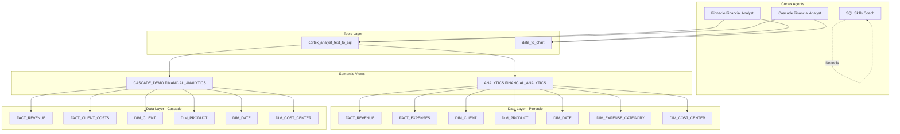

# Solution Architecture

## Overview

This repository manages three Snowflake Cortex AI Agents for Cognizant's financial services demonstrations. Each agent is self-contained with its own specification, deployment scripts, and test fixtures.

## Architecture Diagram



## Component Details

### Agent Layer

| Component | Orchestration Model | Budget |
|-----------|-------------------|--------|
| Pinnacle Financial Analyst | auto | 60s / 16K tokens |
| Cascade Financial Analyst | claude-4-sonnet | 60s / 16K tokens |
| SQL Skills Coach | auto | 60s / 16K tokens |

### Tools Layer

| Tool | Type | Description |
|------|------|-------------|
| cortex_analyst_text_to_sql | Built-in | Converts natural language to SQL via semantic views |
| data_to_chart | Built-in | Generates visualizations from query results |

### Semantic View Layer

Semantic views provide a business-friendly abstraction over raw fact/dimension tables:

- **Metrics**: Pre-defined calculations (TOTAL_REVENUE, BUDGET_VARIANCE, etc.)
- **Dimensions**: Filterable attributes (CLIENT_SEGMENT, PRODUCT_CATEGORY, etc.)
- **Relationships**: Join paths between tables (foreign key mappings)

### Data Layer

All data resides in `<YOUR_DATABASE>` under schema-specific namespaces:
- `ANALYTICS` schema — Pinnacle Financial Services data
- `CASCADE_DEMO` schema — Cascade Wealth Management data

## Deployment Flow

```
1. Developer updates agent_spec.yaml
2. CI validates YAML structure + SQL syntax
3. PR merged to main
4. Deploy script executes CREATE OR REPLACE AGENT
5. Agent is live in Snowflake
```

## Security Considerations

- Agent specs do NOT contain credentials
- Deployment uses Snowflake CLI authentication (key-pair or SSO)
- Role-based access: agents execute under `<YOUR_ROLE>`
- Semantic views enforce column-level access control
